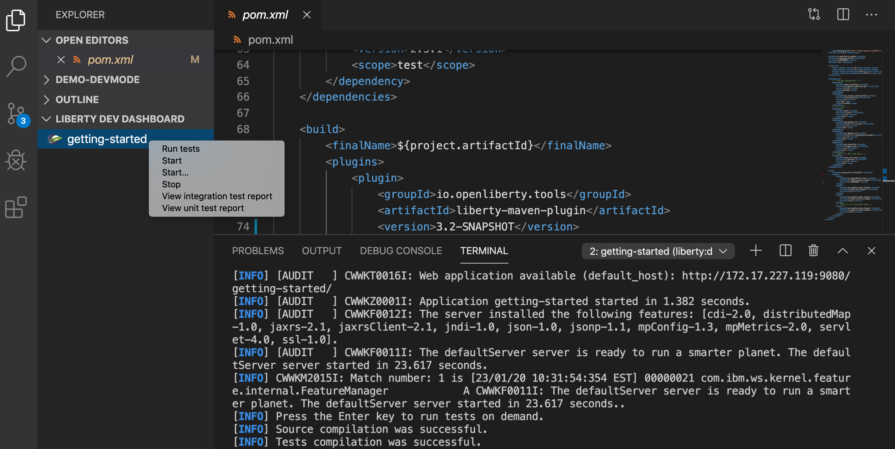

# Open Liberty Tools for VS Code
A VS Code extension for Open Liberty. The extension will detect your Liberty Maven or Liberty Gradle project if it detects the `io.openliberty.tools:liberty-maven-plugin` in the `pom.xml` or `io.openliberty.tools:liberty-gradle-plugin` in the `build.gradle`. Through the Liberty Dev Dashboard, you can start, stop, or interact with Liberty dev mode on all available [Liberty Maven](https://github.com/OpenLiberty/ci.maven/blob/master/docs/dev.md#dev) or [Liberty Gradle](https://github.com/OpenLiberty/ci.gradle/blob/master/docs/libertyDev.md) projects in your workspace.

## Quick Start
- Install the extension
- Open Liberty supported projects will appear in the Liberty Dev Dashboard on the side bar
- Right-click a project in the Liberty Dev Dashboard to view the available commands

## Features
- View supported `liberty-maven-plugin`(version `3.1` or higher) or `liberty-gradle-plugin`(version `3.0` or higher) projects in the workspace
- Start/Stop dev mode
- Start dev mode with custom parameters
- Run tests
- View unit and integration test reports

## Configurable User Settings
| Setting | Description | Default Value |
| --------  | ----------- | -------  |
| liberty.terminal.useJavaHome | If this value is true, and if the setting `java.home` has a value, then the environment variable `JAVA_HOME` will be set to the value of `java.home` when a new terminal window is created. | False |

## Contributing
Contributions to the Open Liberty Tools extension are welcome! 

Our [CONTRIBUTING](CONTRIBUTING.md) document contains details for submitting pull requests.

To build the extension locally:
1. `git clone git@github.com:OpenLiberty/liberty-dev-vscode-ext.git`
2. Execute `npm install`
3. Run the extension in Debug and Run mode by selecting `Run Extension` or `F5`

    Alternatively, build a `.vsix` file:
    - `vsce package` to generate the `liberty-dev-vscode-ext-xxx.vsix` file
    - Install the extension to VS Code by `View/Command Palette`
    - Select `Extensions: Install from VSIX...` and choose the generated `liberty-dev-vscode-ext-xxx.vsix` file

## Issues
Please report bugs, issues and feature requests by creating a [GitHub issue](https://github.com/OpenLiberty/liberty-dev-vscode-ext/issues),