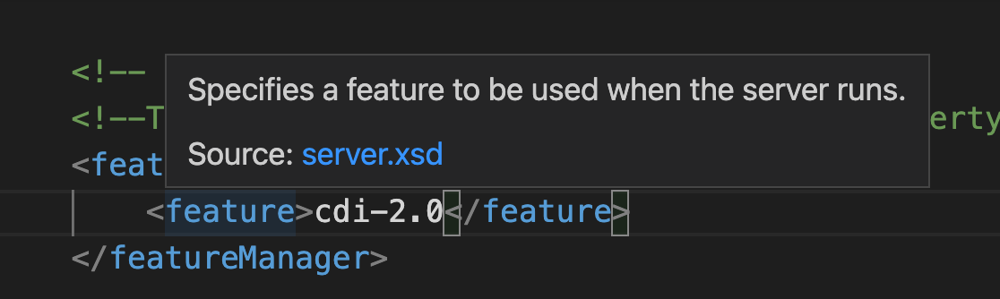
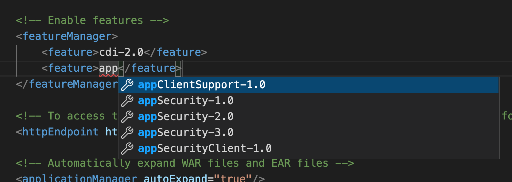
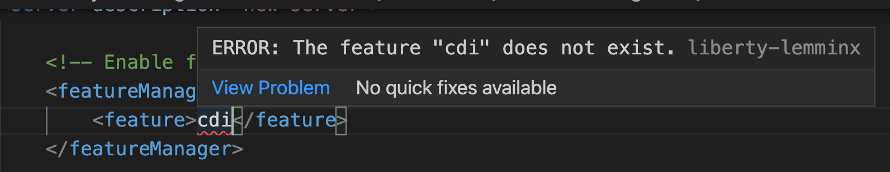
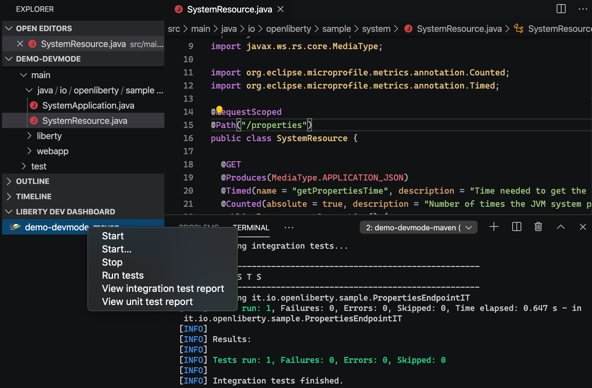

# Open Liberty Tools for VS Code

## Building the Liberty Language Server Prototype

This branch contributes a VS Code language server client consuming the [language server for Liberty configuration prototype](https://github.com/OpenLiberty/liberty-language-server).

To build:
1. Install the [XML by Red Hat](https://marketplace.visualstudio.com/items?itemName=redhat.vscode-xml) VS Code Extension. This extension contributes the LemMinx language server (language support for XML).
2. Clone the liberty-language-server project: `git clone https://github.com/OpenLiberty/liberty-language-server.git`
3. In the same folder, clone this repo: `git clone https://github.com/OpenLiberty/open-liberty-tools-vscode.git`
Directory structure should appear as:
```
├── liberty-language-server
│   ├── lemminx-liberty
│   ├── liberty-ls
└── open-liberty-tools-vscode
```
4. Navigate to the `open-liberty-tools-vscode` project and checkout the "liberty-ls-prototype" branch: `git checkout -b liberty-ls-prototype origin/liberty-ls-prototype`.
3. Install dependencies: `npm install`
4. Build the liberty-language-server prototype: `npm run build`. Runs the [gulpfile.js](gulpfile.js) file. Builds the lemminx-liberty and liberty-ls components, and copies the corresponding jars to the /open-liberty-tools/vscode/jars directory.
```
├── open-liberty-tools-vscode
│   ├── jars
│   │   ├── lemminx-liberty-x.x-SNAPSHOT-jar-with-dependencies.jar
│   │   └── liberty.ls-1.0-SNAPSHOT-jar-with-dependencies.jar

```
5. Run the extension through the "Run and Debug" menu of VS Code, or using shortcut `F5`. 
6. Open a server.xml file in a Liberty project, you should see completion, hover for more information, and diagnostic information within the file.

Hover over an element in a server.xml file for more information:


Feature completion suggestions: 


Feature diagnostics for invalid features:

---

[](https://marketplace.visualstudio.com/items?itemName=Open-Liberty.open-liberty-tools-vscode)
[](https://www.eclipse.org/legal/epl-2.0/)

A VS Code extension for Open Liberty. The extension will detect your Liberty Maven or Liberty Gradle project if it detects the `io.openliberty.tools:liberty-maven-plugin` in the `pom.xml` or `io.openliberty.tools:liberty-gradle-plugin` in the `build.gradle`. Through the Liberty Dev Dashboard, you can start, stop, or interact with Liberty dev mode on all available [Liberty Maven](https://github.com/OpenLiberty/ci.maven/blob/master/docs/dev.md#dev) or [Liberty Gradle](https://github.com/OpenLiberty/ci.gradle/blob/master/docs/libertyDev.md) projects in your workspace.



## Quick Start

- Install the extension
- Open Liberty supported projects will appear in the Liberty Dev Dashboard on the side bar
- Right-click a project in the Liberty Dev Dashboard to view the available commands

## Features

- View supported `liberty-maven-plugin`(version `3.1` or higher) or `liberty-gradle-plugin`(version `3.0` or higher) projects in the workspace
- Start/Stop dev mode
- Start dev mode with custom parameters
- Run tests
- View unit and integration test reports

## Commands

| Command                      | Description                                                                                                                                                                                                                                                                                                                  |
| ---------------------------- | ---------------------------------------------------------------------------------------------------------------------------------------------------------------------------------------------------------------------------------------------------------------------------------------------------------------------------- |
| Start                        | Starts dev mode.                                                                                                                                                                                                                                                                                                             |
| Start…​                      | Starts dev mode with custom parameters. Supported parameters can be found in the documentation for the [dev goal of the Liberty Maven Plugin](https://github.com/OpenLiberty/ci.maven/blob/master/docs/dev.md#dev) and the [libertyDev task of the Liberty Gradle Plugin](https://github.com/OpenLiberty/ci.gradle/blob/master/docs/libertyDev.md#command-line-parameters). |
| Start in container                    | Starts dev mode with the server in a container. The `liberty-maven-plugin` must be version `3.3-M1` or higher. The `liberty-gradle-plugin` must be version `3.1-M1` or higher. |
| Stop                         | Stops dev mode.                                                                                                                                                                                                                                                                                                              |
| Run tests                    | Runs the unit tests and integration tests that are configured for your project. This command requires dev mode to be already started.                                                                                                                                                                                        |
| View integration test report | Views the integration test report file.                                                                                                                                                                                                                                                                                      |
| View unit test report        | Views the unit test report file.                                                                                                                                                                                                                                                                                             |

**Note:** Gradle projects only have a single `View test report` command.

## Configurable User Settings

| Setting                      | Description                                                                                                                                                                                 | Default Value |
| ---------------------------- | ------------------------------------------------------------------------------------------------------------------------------------------------------------------------------------------- | ------------- |
| liberty.terminal.useJavaHome | If this value is true, and if the setting `java.home` has a value, then the environment variable `JAVA_HOME` will be set to the value of `java.home` when a new terminal window is created. | False         |

### External Settings
The following settings provided by external extensions will be honoured when executing dev mode commands.

| Setting                      | Description                                                                                                                                                                                 | Provided By |
| ---------------------------- | ------------------------------------------------------------------------------------------------------------------------------------------------------------------------------------------- | ------------- |
| maven.executable.path | Maven commands executed by dev mode will honour this setting. When this value is empty, it tries to use `mvn` or `mvnw` according to the value of `maven.executable.preferMavenWrapper`. | [Maven for Java extension](https://marketplace.visualstudio.com/items?itemName=vscjava.vscode-maven)         |
| maven.executable.preferMavenWrapper | Maven commands executed by dev mode will honour this setting. If true, it tries to use `mvnw` if a Maven wrapper file can be found. Otherwise it will use `mvn`. | [Maven for Java extension](https://marketplace.visualstudio.com/items?itemName=vscjava.vscode-maven)         |
| java.import.gradle.wrapper.enabled | Gradle commands executed by dev mode will honour this setting. If true, it tries to use `gradlew` if a Gradle wrapper file can be found. Otherwise it will use `gradle`. | [Language support for Java extension](https://marketplace.visualstudio.com/items?itemName=redhat.java)        |

## Requirements

- [Tools for MicroProfile extension for Visual Studio Code](https://marketplace.visualstudio.com/items?itemName=redhat.vscode-microprofile)

## Contributing

Contributions to the Open Liberty Tools extension are welcome!

Our [CONTRIBUTING](CONTRIBUTING.md) document contains details for submitting pull requests.

To build the extension locally:

1. `git clone https://github.com/OpenLiberty/open-liberty-tools-vscode`
2. `cd open-liberty-tools-vscode`
3. Execute `npm install`
4. Run the extension in Debug and Run mode by selecting `Run Extension` or `F5`

   Alternatively, build a `.vsix` file:

   - `vsce package` to generate the `open-liberty-tools-vscode-xxx.vsix` file
   - Install the extension to VS Code by `View/Command Palette`
   - Select `Extensions: Install from VSIX...` and choose the generated `open-liberty-tools-vscode-xxx.vsix` file

## Issues

Please report bugs, issues and feature requests by creating a [GitHub issue](https://github.com/OpenLiberty/open-liberty-tools-vscode/issues).