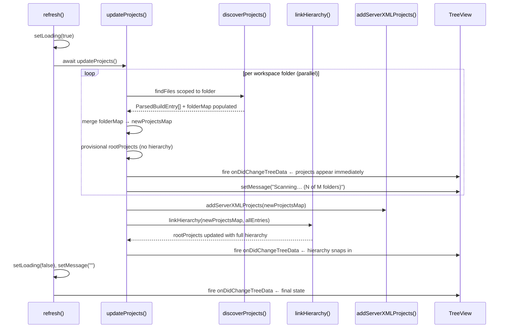

# Multi-Module Project Detection Algorithm

Reference for contributors working on `ProjectProvider` in `src/liberty/libertyProject.ts`.

---

## Overview

Liberty Tools scans the VS Code workspace to detect Maven and Gradle projects that use the Liberty build plugin. For multi-module builds (Maven aggregators / Gradle settings includes), it reconstructs the parent-child hierarchy so the tree view can reflect nesting. The algorithm runs in four phases, split across three methods to enable **per-folder incremental rendering**.

---

## Key Data Structures

| Structure | Type | Purpose |
|---|---|---|
| `ParsedBuildEntry` | `interface` | One entry per discovered build file. Carries the raw parsed content (XML string for Maven, g2js AST or regex result for Gradle) so each file is read exactly once. |
| `projectsMap` | `Map<string, LibertyProject>` | Output parameter: keyed by absolute build file path, holds fully-constructed `LibertyProject` instances. |
| `allEntries` | `ParsedBuildEntry[]` | All parsed entries returned by `discoverProjects`; accumulated across folders and passed to `linkHierarchy` for phase 4. |
| `rootProjects` | `LibertyProject[]` | Subset of projects with no parent. Drives `getChildren(undefined)` — the top-level tree nodes. |

---

## Call Flow



---

## Phase Breakdown

### Phase 1 — Read & Parse (`discoverProjects`)

All build files for a single workspace folder are read and parsed **in parallel** via `Promise.all`.

- **Maven** (`pom.xml`): raw XML string loaded via `fse.readFile`. Parsing deferred to phase 2 via `xml2js`.
- **Gradle** (`build.gradle`): fast path tries regex detection first (`detectLibertyPluginFromText`). Only invokes the full `g2js.parseFile()` parser when legacy `buildscript {}` syntax is detected — this is the most expensive step and is skipped whenever possible. `settings.gradle` is parsed when `include` statements are present (needed for aggregator detection).

Output: `ParsedBuildEntry[]` — one entry per file, carrying all parsed data. **Returned to the caller** (`updateProjects`) so phase 4 can use it after all folders are merged.

### Phase 2 — Classify Parents (`discoverProjects`)

Scans `ParsedBuildEntry[]` to identify which build files are **aggregator parents**:

- **Maven**: calls `mavenUtil.validParentPom()` on each entry. Builds `mavenChildMap` (parent artifactId → child paths) and `mavenParentPaths` set.
- **Gradle**: calls `gradleUtil.findChildGradleProjects()` using parsed settings. Builds `gradleChildSet` (directory names of child modules) and `gradleParentPaths` set.

No I/O in this phase.

### Phase 3 — Validate & Create (`discoverProjects`)

Creates `LibertyProject` objects in parallel. Each entry is classified as one of:

| Classification | Maven | Gradle |
|---|---|---|
| **Aggregator parent** | `validParentPom()` | `findChildGradleProjects()` → `GradleBuildFile(true, ...)` |
| **Child module** | `validPom(xml, childMap)` | `validateGradleChildModule()` |
| **Standalone** | `validPom(xml, childMap)` | `validGradleBuild()` — must have Liberty plugin |

Reuses existing `LibertyProject` instances from `this.projects` when the build file was already known — preserves terminal state across refreshes.

Output: entries written into the caller-provided `projectsMap`. Return value is `ParsedBuildEntry[]`.

### Phase 4 — Hierarchy Linking (`linkHierarchy`)

Runs **once** after all workspace folders complete, over the fully-merged `projectsMap`. No I/O.

1. **Metadata extraction**: calls `mavenUtil.extractMavenMetadata` / `gradleUtil.extractGradleMetadata` per entry to populate `artifactId`, `parentArtifactId`, `isAggregator`, `isLibertyEnabled`.
2. **Link via `parentArtifactId`**: standard Maven `<parent>` element / Gradle `rootProject.name`. Sets `project.parent` and pushes to `parent.children`.
3. **Link via filesystem paths**: fallback for Maven projects missing a `<parent>` element — walks `<modules>` in aggregator POMs and resolves child paths on disk.
4. **Stamp aggregator context values**: sets `LIBERTY_PROJECT_MAVEN_AGGREGATOR` / `LIBERTY_PROJECT_GRADLE_AGGREGATOR` on aggregator nodes.
5. **Compute `rootProjects`**: projects with no parent that are Liberty-enabled or have Liberty-enabled descendants.

---

## Incremental Rendering

`updateProjects` runs per-folder discovery in parallel (`Promise.all` over `workspaceFolders`). After each folder's phases 1–3 complete:

1. Folder results merged into `newProjectsMap`.
2. `this.rootProjects` set to provisional roots (flat — no hierarchy yet, since `linkHierarchy` hasn't run).
3. `_onDidChangeTreeData` fired → tree renders immediately with whatever is known.
4. `TreeView.message` updated to show `"Scanning… (N of M folders)"`.

After all folders complete, `linkHierarchy` runs and a final `_onDidChangeTreeData` fires. The hierarchy (nesting) snaps into place at that point.

**Trade-off**: users may briefly see projects as flat roots before nesting resolves. This is intentional — responsiveness over completeness on initial load.

---

## Loading Indicator

A VS Code context key `liberty:loading` gates two `viewsWelcome` entries in `package.json`:

```json
{ "view": "liberty-dev", "contents": "$(loading~spin) Scanning…", "when": "liberty:loading" }
{ "view": "liberty-dev", "contents": "… instructions …",         "when": "!liberty:loading" }
```

`setLoading(true)` is called at the top of `refresh()` and `setLoading(false)` in its `finally` block — so the spinner is always cleaned up even on error.

---

## Server.xml Fallback (`addServerXMLProjects`)

After the main scan, for any workspace folder with no discovered projects, the fallback searches for `**/src/main/liberty/config/server.xml`. It walks 4 directories up to infer the project root and adds the corresponding `pom.xml` or `build.gradle` if found. These projects bypass phases 1–4 and are added directly to `projectsMap`.

---

## Method Reference

| Method | Signature | Role |
|---|---|---|
| `refresh` | `(): Promise<void>` | Entry point. Sets loading state, calls `updateProjects`, fires final change event. |
| `updateProjects` | `(): Promise<void>` | Per-folder parallel orchestrator. Merges results, fires incremental tree updates. |
| `discoverProjects` | `(pomPaths, gradlePaths, projectsMap): Promise<ParsedBuildEntry[]>` | Phases 1–3 for one folder's file set. Mutates `projectsMap`, returns raw parsed entries. |
| `linkHierarchy` | `(projectsMap, allEntries): Promise<void>` | Phase 4. Wires parent-child, stamps aggregators, sets `rootProjects`. |
| `addServerXMLProjects` | `(projectsMap): Promise<void>` | Fallback discovery via `server.xml`. |
